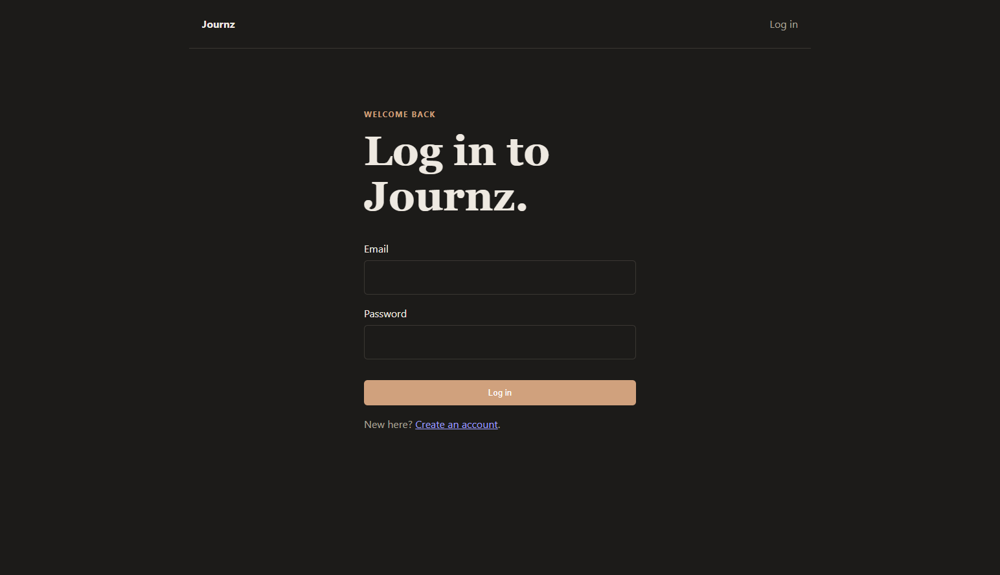
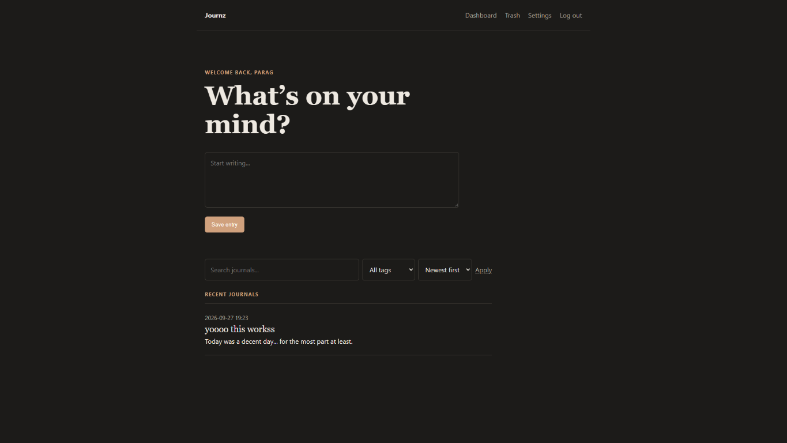

# Journz

Journz is a simple private journaling app. It gives you a quiet place to write,
edit, search, and manage journal entries without getting in the way.

Live app: [journz.onrender.com](https://journz.onrender.com)

## Screenshots

### Log in



### Main page



## Features

- Create an account and log in securely
- Create, edit, and delete private journal entries
- Autosave journal entries while you write
- Search through journal titles and content
- Add tags to journal entries and filter by tag
- Sort entries by title or most recently updated
- Move entries to the trash and restore them later
- Pagination for larger journal collections
- CSRF protection and secure session cookies
- Responsive, distraction-free interface

## Tech stack

- **Python** — application language
- **FastAPI** — web framework and routing
- **Jinja2** — server-rendered HTML templates
- **SQLModel** — database models and queries
- **SQLite** — local development database
- **JavaScript and CSS** — autosave behavior and the user interface
- **Render** — hosting for the live app

The app currently uses SQLite for local development. A PostgreSQL database will
be added for production storage on Render.

## Run locally

From the project directory, create the virtual environment and install the
dependencies:

```bash
uv venv .venv
uv sync
```

Start the development server:

```bash
uv run uvicorn app.main:app --reload
```

Open <http://127.0.0.1:8000/> in your browser.

The local SQLite database is created at `data\journz.db` the first time the
app starts.

## Configuration

The app has default settings, so a `.env` file is optional for local
development. To use the example configuration, copy `.env.example` to `.env`:

```bash
cp .env.example .env
```

The current settings are:

```text
JOURNZ_DEBUG=true
JOURNZ_DATABASE_URL=sqlite:///data/journz.db
```

The `.env.example` file can be committed, but the actual `.env` file should not
be committed because it may contain private values. On Render, add environment
variables through the service's Environment settings instead of uploading a
`.env` file.

## Project structure

- `app/main.py` — FastAPI application and routes
- `app/models.py` — database models for users, sessions, journals, and tags
- `app/auth.py` — authentication, password hashing, and session handling
- `app/db.py` — database engine and table setup
- `app/templates/` — Jinja2 templates
- `app/static/` — CSS and JavaScript

## Main routes

- `/register` — create an account
- `/login` — log in
- `/logout` — log out
- `/` — dashboard and journal composer
- `/journals/{id}` — edit a journal entry
- `/trash` — view and restore deleted entries
